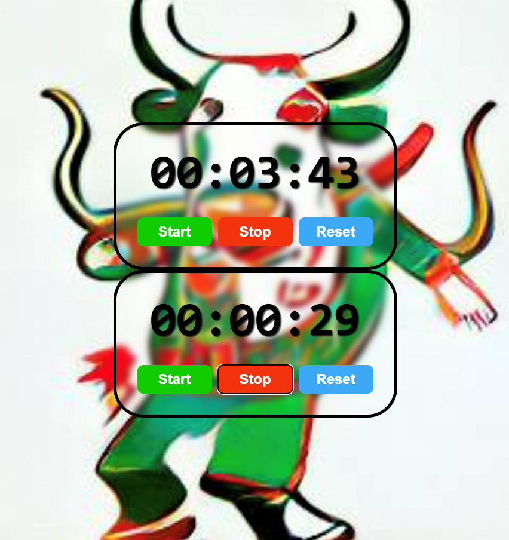

# React Stopwatch Component

## Overview

This is a simple React stopwatch component that allows users to start, stop, and reset a timer with millisecond precision.



## Features

- Start/Stop functionality
- Reset timer option
- Displays time in minutes:seconds:milliseconds format

## Component Details

The `Stopwatch` component uses React hooks for state management:

- `useState` for tracking running state and elapsed time
- `useEffect` for managing timer intervals
- `useRef` to maintain references to interval and start time

## Installation

To install the necessary dependencies, run:
```bash
npm install react

## Usage

To use the stopwatch component, import it into your main application file:
```bash
import Stopwatch from './Stopwatch';
function App() {
return <Stopwatch />;
}

## Key Hooks and Logic

### State Variables:

- **isRunning**: Tracks if the stopwatch is active.
- **elapsedTime**: Stores the current elapsed time in milliseconds.

### Methods:

- **start()**: Begins the stopwatch.
- **stop()**: Pauses the stopwatch.
- **reset()**: Resets the timer to zero.
- **formatTime()**: Converts milliseconds into a readable time format.

## Time Formatting

The `formatTime()` method converts elapsed time into a two-digit format for:

- Minutes
- Seconds
- Milliseconds

## Performance Optimization

The stopwatch uses `setInterval` with 10ms updates, and includes a cleanup function to prevent memory leaks when the component unmounts or when the stopwatch is stopped.
